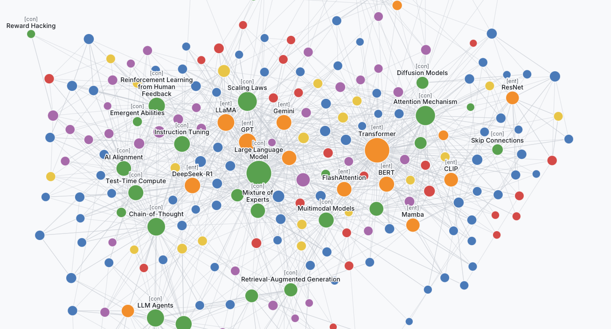

# Curiosity Engine


*An example knowledge graph displayed by the skill's built-in viewer.*

Autonomously and collaboratively organizes and improves personal knowledge bases with you.

Built for use with frontier coding agents. Primary target is [Claude Code](https://claude.com/claude-code); OpenClaude, Codex CLI, Gemini CLI, and GitHub Copilot Chat in VS Code all work with minor adjustments. Worker and reviewer models are plain strings in `.curator/config.json` — swap Anthropic defaults for Gemini, OpenAI, or a fully-local Ollama endpoint. The wiki is plain markdown — open it in the built-in viewer, or Obsidian, browse the graph, edit by hand. Everything's git-tracked.

## How it works

Three objects, three verbs.

```
  your files
      │
      ▼
  ┌─────────┐       ┌───────────┐      ┌─────────┐
  │  vault  │──────▶│  curator  │─────▶│  wiki   │
  │ (raw)   │ reads │  (agent)  │writes│ (notes) │
  └─────────┘       └───────────┘      └─────────┘
                         ▲                  │
                         │ ask              │ answer
                         └──────── you ─────┘
```

Curiosity Engine ingests documents in many formats and decomposes them into entities, concepts, evidence, facts, tables and figures. It auto-improves the knowledge base structure during its curation run and explores new connections by proposing questions that it answers by writing analyses grounded in the knowledge it has built. It works for a wide variety of types of knowledge, from scientific research, to investment analysis, contract management, accounting, sales and marketing.

Zooming into the curator:

```
                ┌─────────────────┐
                │ 🎯 Orchestrator │
                └────────┬────────┘
                         │ dispatches per wave
           ┌─────────┬───┴────┬────────────┐
           ▼         ▼        ▼            ▼
       ┌───────┐ ┌────────┐ ┌───────┐ ┌──────────┐
       │Worker │ │Reviewer│ │ Spot  │ │   Link   │
       │Sonnet │ │ Opus   │ │auditor│ │proposer +│
       │writes │ │ batch  │ │ Opus  │ │classifier│
       │pages +│ │semantic│ │sampled│ │ Opus,    │
       │figures│ │  gate  │ │adversy│ │fresh ctx │
       └───┬───┘ └───┬────┘ └───┬───┘ └─────┬────┘
           │         │          │           │
           └────┬────┴────┬─────┴──────┬────┘
                ▼         ▼            ▼
         score_diff  scrub_check  evolve_guard
         (citations  (injection   (script-hash
          · bloat ·   guard)       integrity)
          floors)
                │
                ▼ accept
      ┌─────────────────────────────────────────────┐
      │             State — three stores            │
      ├──────────────┬──────────────┬───────────────┤
      │ Docs (git)   │ Relational   │ Graph         │
      │              │              │               │
      │ vault/       │ vault.db     │ graph.kuzu    │
      │ wiki/ 8 page │  FTS5 + vec  │  WikiLink     │
      │   types +    │ tables.db    │  Cites        │
      │   _assets    │  class rows  │  DataRef      │
      │ .curator/log │              │  Depicts      │
      └──────┬───────┴──────────────┴───────────────┘
             │ feedback: epoch_summary · graph queries · FTS5
             └──────────────▶ Orchestrator
```

- **Vault** (`vault/`) — append-only store of raw sources; never modified after ingest. FTS5 keyword-indexed; optional MiniLM semantic index for fuzzier queries on large corpora.
- **Wiki** (`wiki/`) — git-tracked markdown with `[[wikilinks]]` and `(vault:path)` citations. Eight subdirectories by page type: `sources`, `entities`, `concepts`, `analyses`, `evidence`, `facts`, `tables`, `figures` — each with a conventional shape.
- **Curator** — an agent that reads the vault, writes in the wiki, and improves the notes during curate runs.

Three verbs:

- **`ingest`** — *"add `~/papers/foo.pdf` to the vault"*. The source is copied in, text extracted, indexed.
- **`query`** — *"what do I know about transformers?"* The curator searches the wiki and vault, answers with citations, ends with a question to probe further.
- **`curate`** — *"curate this wiki for an hour"*. The curator runs a plan-execute-evaluate loop, drafts improvements in parallel, gates each through a mechanical check, has a reviewer judge the wave, and commits.

**Notes and todos — raw-input paths for your own thinking:**

- `/note <anything>` dumps a free-form note into `wiki/notes/new.md`. The curator drains it into a topic file (`wiki/notes/<topic>.md`) on the next sweep — routed by `[[wikilinks]]` in the note, by a `topic:` cue, or by agent inference during CURATE.
- `/todo <text>`, `/day <text>`, `/month <text>`, `/year <text>` — add to-dos with intent-detected or explicit priority. The canonical store is a `todos` class table; pages under `wiki/todos/` are priority-bucket views. Ticking `[x]` in any mention-site propagates to the others and appends to the yearly completion archive (`wiki/todos/YYYY.md`) with created + completed dates.
- Slash commands only register in Claude Code (`.claude/commands/*.md`); on other CLIs, natural-language invocations hit the same code paths.

## Quick start

```bash
# install the skill (pick one path — all equivalent)
claude skill install curiosity-engine
npx skills add benjsmith/curiosity-engine
# or: git clone into ~/.claude/skills/curiosity-engine/

# set up a workspace
mkdir my-research && cd my-research
claude
> set up a knowledge base here
> add ~/papers/some-paper.pdf to the vault
> what do I know about transformer architectures?
> curate this wiki for an hour
```

The first command runs `setup.sh`, which creates the folder layout, initialises the wiki git repo, drops in a Claude Code settings file that auto-allows safe operations, and optionally installs companion skills.

**Backing up the wiki** (optional but recommended). The `wiki/` folder is its own git repository, independent of the workspace. Push it to GitHub / GitLab / internal to back it up and sync across machines:

```bash
cd my-research/wiki
git remote add origin git@github.com:<you>/<repo>.git
git push -u origin main
```

**Updating the skill without exiting the session.** Ask the agent to "update the skill". It runs `scripts/update.sh`, which detects the install channel automatically — `git pull --ff-only` for git-clone installs, `npx skills update -g <slug>` for npx-skills installs — prints a preview (commit log for git, update plan for npx), and waits for you to confirm. Once confirmed, it auto-commits any in-progress wiki edits with a canned `wip: auto-commit before skill update` message, applies the update, and runs `setup.sh` to apply any migrations. The npx-skills slug is stored in `.curator/config.json` as `update_source_slug` — fork users edit it there to point at their fork.

### Running in other coding-agent CLIs

Same `setup.sh` works; `.claude/settings.json` is skipped or ignored by non-Claude-Code CLIs. Point your CLI at the cloned skill folder and drive it with the same "set up a knowledge base", "add to the vault", "curate" prompts.

- **OpenClaude** — drop the skill into `~/.openclaude/skills/`; skill-path substitution works.
- **Codex CLI** — clone into a known scripts directory and export `CURIOSITY_ENGINE_SCRIPTS_DIR=<path>/scripts` so prompts without `<skill_path>` substitution still resolve.
- **GitHub Copilot Chat (VS Code)** — clone anywhere, open the workspace folder in VS Code, and paste the contents of `SKILL.md` into the chat's workspace instructions. The single-chat-window flow works: Copilot runs as the orchestrator, dispatches subagents where supported, and falls back to sequential in-session workers with explicit role-reset prompts where not (see `SKILL.md#single-session-fallback`). To avoid per-command approval prompts, open VS Code's settings for the chat/agent feature and allow the bash + file tools at the workspace level — the commands that need allowing are listed in `.claude/settings.json`'s `permissions.allow` array after `setup.sh` runs; translate them into the per-workspace allowlist your VS Code version exposes.
- **Gemini CLI** — clone anywhere, export `CURIOSITY_ENGINE_SCRIPTS_DIR`, and point `worker_model` / `reviewer_model` at `gemini-2.5-pro` etc.

### Running with different models (incl. fully local via Ollama)

`worker_model` and `reviewer_model` in `.curator/config.json` are plain identifier strings passed to whatever coding-agent CLI is driving the skill. Defaults target Anthropic but nothing in the Python scripts depends on a specific vendor.

See `template/config.example.json` for working variants:

```json
{
  "worker_model":   "claude-sonnet-4-6",      // Anthropic (default)
  "reviewer_model": "claude-opus-4-6",

  "worker_model":   "gemini-2.5-pro",         // Google
  "reviewer_model": "gemini-2.5-pro",

  "worker_model":   "gpt-5",                  // OpenAI
  "reviewer_model": "gpt-5",

  "worker_model":   "ollama/llama3.1:70b",    // Fully local via Ollama
  "reviewer_model": "ollama/qwen2.5:72b"
}
```

**Fully local via Ollama.** Requires an Ollama-compatible coding-agent CLI (Continue.dev, Cody, or Claude Code routed through an OpenAI-compatible proxy). `ollama serve` locally, `ollama pull` the models above, edit `.curator/config.json` to match. Caveats: open-weight models will drop citations more often than frontier Sonnet/Opus — tune `parallel_workers` down and expect more `score_diff` rejections. Semantic search still works locally (MiniLM runs offline via sentence-transformers).

**Enterprise notes.** No code sends wiki/vault content anywhere except to the model API your CLI drives; swap to Ollama for fully on-prem. PyPI access is required at setup time; HuggingFace egress is required only if you opt into semantic search (can be pre-staged via `HF_HOME`).

### Deployment notes

- **Disk footprint.** Rough guide: `vault/` ≈ the size of your source PDFs (~50 MB per 100 academic papers). `vault.db` adds ~10–30% for FTS5 indexing. Semantic embeddings (opt-in) add ~0.5 MB per indexed line — ~200 MB for a 100-source vault. `wiki/figures/_assets/` at 150 DPI is ~0.3–0.6 MB per rendered page; figure extraction typically renders 5–20 pages per source. Budget a few GB for a 100-source knowledge base with semantic search + figures on.
- **Backup & restore.** `wiki/` is a git repo — push it wherever you back up code. `vault/` holds your raw sources — back it up like any data folder; re-ingest is expensive (it's what you pay the curator to do). `vault.db`, `graph.kuzu`, and `wiki/figures/_assets/` are all derived and auto-regenerate from vault + wiki on the next `setup.sh` / `graph.py rebuild` / `figures.py regen` run (the asset folder is gitignored inside the wiki repo for the same reason). The one non-regeneratable store is `.curator/tables.db` (class-entity row data is source-of-truth in SQLite, not derivable from git-tracked files) — back it up separately if you've used class tables.
- **Rendering outside Obsidian.** Wiki figure and summary-table pages use Obsidian's `![[asset.png]]` transclusion syntax, which renders inline in Obsidian but shows as literal text in GitHub and generic markdown viewers. The underlying data is still there; it just looks worse until opened in Obsidian.
- **No-network / air-gapped install.** `setup.sh` uses `curl … | sh` to install `uv` when missing. For environments where that's blocked, pre-install uv via `pip install uv` first and re-run `setup.sh` — it'll detect the existing uv and skip the curl step. Same applies to pypdfium2 / Pillow / kuzu / pyyaml — pre-populate a PyPI mirror and `pip install` them; setup.sh uses `uv pip install` which respects `UV_INDEX_URL` / `PIP_INDEX_URL` for internal mirrors.

## What makes it different

- **Every claim is cited.** Every factual claim cites a vault source. A mechanical gate (`score_diff.py`) rejects any edit that drops a citation or adds one whose source doesn't FTS5-match the claim.
- **Wiki structure IS the semantic layer.** Concept and entity pages are the hubs; wikilinks express relationships. No vector DB required — though one can be bolted on for fuzzy fallback on large corpora.
- **Keep-or-revert ratchet.** Autonomous curator proposes edits; a reviewer grades; accepted edits commit, rejected ones revert. The wiki never regresses.
- **Hash-guarded scoring.** Scoring scripts are SHA-256 hashed between waves; the curator can't edit them to game its own metrics.
- **Obsidian-compatible.** Open `wiki/` as an Obsidian vault — wikilinks, backlinks, graph view all work without plugins.

## When to use (and when not)

**Fits well when:**
- You're reading hundreds or thousands of substantial sources in a domain over weeks or months.
- You care about provenance — every claim traceable to a vault file.
- You want cross-source connections surfaced, not just stored.
- You want the understanding to persist across sessions and compound.
- You don't mind waiting a minute for accurate answers.

Good fits: personal research, literature reviews, research notebooks, due-diligence analysts, cross-field synthesis.

**Doesn't fit when:**
- You want instant answers from a huge (>1000) doc store → use RAG (LlamaIndex, LangChain).
- You're working on code → use Claude Code directly on the repo.
- You need multi-user collaboration → Obsidian sync, Notion, Confluence.
- Knowledge is structured (tables, time-series) → a database.

For the full design rationale (why not RAG, how the ratchet works, where the skill struggles), see [`docs/architecture.md`](docs/architecture.md).

## Viewing the wiki

**Obsidian (default, richest view).** `wiki/` is plain markdown with `[[wikilinks]]`. Open Obsidian → **Open folder as vault** → pick `<your-workspace>/wiki`. Backlinks and the graph view light up immediately, no plugins. Figure asset PNGs live at `wiki/figures/_assets/` (inside the vault scope, so inline image embeds render without reconfiguration). The `_assets/` folder is gitignored; Obsidian's graph view by default hides image nodes, but if you've turned "Show attachments" on you can scope them out with a `-path:_assets` filter. Leave Claude Code running in the workspace root; Obsidian picks up new pages as the curator writes them. Treat Obsidian as a read-mostly view — manual edits outside a `git -C wiki commit` won't be seen by the curator until the next operation reads the page.

**VS Code + Foam (enterprise-friendly alternative).** If Obsidian isn't installable, open the workspace in VS Code and add the **Foam** extension (free, open-source, typically on enterprise marketplaces). Foam renders `[[wikilinks]]` as clickable links, adds a backlinks panel, and provides a lightweight graph view — the core of what Obsidian gives you. Toggle `wiki_viewer_mode: "vscode"` in `.curator/config.json` and re-run setup.sh; a one-time sweep converts figure-page image embeds from Obsidian-transclusion syntax (`![[figures/_assets/foo.png]]`) to standard markdown (``) so VS Code's built-in preview renders them inline. Switch back to `"obsidian"` and re-run setup.sh to convert them back.

**Static viewer (graph-first, browser-based).** Run `bash <skill_path>/scripts/viewer.sh open` to build and serve a graph-first static site on `http://localhost:8090`. Force-directed D3 graph at the centre, type-grouped content browser on the left with fuzzy search, click-to-open doc viewer modal with a 1-hop subgraph navigator at the bottom for hop-by-hop exploration. Figure pages render their PNG inline. Live physics knobs in a top-right settings panel. No Node.js dependency — pure Python build + vanilla JS frontend with vendored D3 + Fuse downloaded once into `~/.cache/curiosity-engine/wiki-view-vendor/`. Each workspace's bundle goes into `~/.cache/curiosity-engine/wiki-view/<workspace>/`. Rerun `viewer.sh build` after curator writes to refresh.

## Caveman mode (optional compression)

[JuliusBrussee/caveman](https://github.com/JuliusBrussee/caveman) is a companion skill that strips filler tokens so the curator writes terse, dense pages (~30–40% reduction). Setup prompts to install it; answer `y` to wire in. Configured via the `caveman` block in `.curator/config.json`. Details in the skill's SKILL.md.

## Semantic vault search (optional)

For vaults above a few hundred sources where keyword search starts missing fuzzy matches, an optional MiniLM embedding index layered over sqlite-vec gives the curator a semantic fallback. Setup prompts to install `sentence-transformers` + `sqlite-vec` (~200MB model download); opt in only if you need it. Embeddings augment FTS5, never replace — keyword stays primary.

## Inspired by

| From | Idea taken |
|---|---|
| [Karpathy's LLM-Wiki](https://gist.github.com/karpathy/442a6bf555914893e9891c11519de94f) | The wiki as a compounding artefact. |
| [Karpathy's Autoresearch](https://github.com/karpathy/autoresearch) | Keep-or-revert ratchet with a measurable metric. Git as the ledger. |
| [MemPalace](https://github.com/milla-jovovich/mempalace) | Store source material verbatim; don't distill at ingest. |
| [JuliusBrussee/caveman](https://github.com/JuliusBrussee/caveman) | Optional companion skill for read/write token compression. |

## Dependencies

- **Python 3** — most scripts use stdlib only.
- **[uv](https://github.com/astral-sh/uv)** (required) — workspace venv + script runner. Installed by `setup.sh` if missing.
- **[kuzu](https://kuzudb.com/)** (required) — embedded property-graph database for structural queries. Auto-installed into the workspace venv.
- **[sentence-transformers](https://sbert.net/)** + **[sqlite-vec](https://github.com/asg017/sqlite-vec)** (optional) — semantic vault search. ~200MB model.
- **[JuliusBrussee/caveman](https://github.com/JuliusBrussee/caveman)** (optional) — read/write compression.
- **git** — the wiki is a git repo.
- **A frontier coding-agent CLI with file-tool + subagent-dispatch support** — this is a skill, not a standalone CLI. Claude Code is the primary target; OpenClaude, Codex CLI, Gemini CLI, and GitHub Copilot Chat in VS Code work with the adjustments noted under Quick start.

## License

MIT
