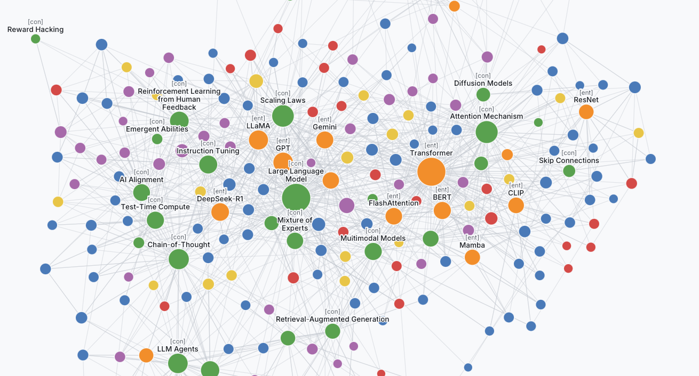

# Curiosity Engine


*An example knowledge graph displayed by the skill's built-in viewer.*

A self-improving knowledge wiki for coding-agent CLIs. Drop sources in, ask questions, and let autonomous "curate" loops draft improvements in parallel — each gated by a citation-preserving ratchet, judged by a fresh-context reviewer, and committed if it earns its place. The wiki is plain markdown, git-tracked, and yours to edit.

## What it does

Two content stores, two derived databases, one curator, three commands:

- **Vault** (`vault/`) — raw sources: PDFs, docs, spreadsheets, slides. Append-only.
- **Wiki** (`wiki/`) — the knowledge itself: eleven markdown page types with `[[wikilinks]]` and `(vault:path)` citations, git-tracked. The markdown is the source of truth.
- **Databases** (derived, rebuildable) — SQLite for search and class-entity rows (`vault.db` FTS5 + optional vectors, `tables.db`), plus an embedded kuzu property graph (`graph.kuzu`) for wikilink traversal and graph retrieval.
- **Curator** — the autonomous agent this skill implements. Reads the vault, writes the wiki, keeps the databases in sync.
- **`ingest`** — *"add this paper to the vault"*. Extracts text + tables + figures, indexes for keyword (and optional semantic) search.
- **`query`** — *"what do I know about X?"*. Answers with citations, ends with a probing follow-up question.
- **`curate`** — *"curate this wiki for an hour"*. Plan → execute → evaluate loop. Worker subagents draft improvements in parallel; a fresh-context reviewer grades each wave; hash-guarded scoring scripts the agent can't tamper with.

## Features

Everything the skill does, in one line each:

- **Eleven wiki page types** with per-type floors enforced mechanically: `sources`, `entities`, `concepts`, `analyses`, `evidence`, `facts`, `tables`, `figures`, `notes`, `todos`, `projects`.
- **Citation-preserving ratchet**: `score_diff.py` rejects any edit that drops a citation or adds one whose source doesn't FTS5-match the claim. The wiki never regresses.
- **Built-in graph viewer** at `localhost:8090` — D3 force graph, type-grouped browser, fuzzy search, click-to-open modal with a hop-by-hop subgraph navigator. Or open `wiki/` as an Obsidian vault. Or use VS Code + Foam.
- **Multimodal table & figure extraction** from PDFs. Per-table `tab-*.md` pages, with row data mirrored to a queryable SQLite store. Numeric literal-transcription mode for scientific work.
- **Identifier resolution** for chemicals (PubChem) and gene symbols (MyGene.info). Cached locally; lazy lookup at synthesis time only.
- **Class tables** — entity-instance data (deals, patients, contracts, matters) with schemas declared on entity pages, rows citing vault provenance. Queryable via `tables.py`; joinable with the kuzu graph.
- **Three storage layers, one source-of-truth file per fact**: plain markdown for prose, SQLite for class-entity row data, embedded kuzu property graph for wikilink + relational-edge traversal. The two databases are derived state.
- **Graph retrieval with query routing** — `graph.py retrieve` does semantic seed → multi-hop BFS over the knowledge graph → ranked pages with provenance, routing global/sensemaking queries graph-only and blending vault-vector recall into factoid/multi-hop queries. Policy validated by a controlled CE-vs-RAG benchmark (graph+curation reach parity with vector RAG on factoids and win multi-hop + sensemaking). An **entity-resolution abstention gate** (`entity_gate.py`) resolves named entities against the curated identity layer before answering — look-alike / non-existent names abstain instead of false-bridging to a similarly-named entity; known aliases still resolve.
- **Two-tier graph** — alongside curated typed edges, `rebuild` derives cheap provisional edges (co-citation + embedding-neighbor, no LLM, kuzu-only) that warm retrieval on day one and queue as candidates for the LINK pass, which promotes them to real `[[wikilinks]]` or prunes them.
- **Semantic search** (optional, opt-in) — a shared local embedder (fastembed/ONNX + bge-small preferred — no PyTorch; sentence-transformers/MiniLM fallback) + sqlite-vec, layered over FTS5 for fuzzy queries on large corpora. Keyword stays primary. Text never leaves the machine.
- **Multi-project model** — many projects in one wiki, derived from the citation graph (not declared by the user); recency-weighted curation, soft-delete, cross-wiki merge via the companion [`curiosity-merge`](https://github.com/benjsmith/curiosity-merge) skill.
- **Code-repo integration** — register a code repo against a CE workspace; capture decisions, gotchas, agent findings into the workspace's vault. Curate runs against the workspace, never inside the code repo. Per-(repo, branch) session brief gives a fresh agent yesterday's context for files in the current diff.
- **Notes + todos** as first-class types. `/note`, `/day`, `/month`, `/year`, `/todo` slash commands in Claude Code; same flows via natural language on other CLIs. Ticking `[x]` propagates across mention-sites and appends to the yearly completion archive.
- **Hash-guarded scoring + sweep scripts** — snapshot at wave start, integrity check at wave end, drift aborts the wave. The curator can't edit its own metrics.
- **Multi-backend** — Claude (default), Codex, Gemini, Copilot Chat, Cursor, fully local via Ollama. One JSON file (`active_preset`), one env var (`CURATOR_PRESET`) for per-session swap.

## Quick start

```bash
# install the skill (pick one — both equivalent)
npx skills add benjsmith/curiosity-engine
# or via git (the skill lives in skills/curiosity-engine/ inside the repo):
#   git clone https://github.com/benjsmith/curiosity-engine ~/curiosity-engine
#   ln -s ~/curiosity-engine/skills/curiosity-engine ~/.claude/skills/curiosity-engine
#
# Since v0.7.0 the skill lives in a subdirectory, which every skills-CLI
# version installs correctly. If an old add/update (skills 1.5.13–1.5.16
# against the pre-v0.7.0 layout) left you with a SKILL.md-only skill
# folder, just run the add command above again — it repairs the install.
# No workspace data (wiki/vault) is ever affected by that CLI bug.

# set up a workspace
mkdir my-research && cd my-research
claude
> set up a knowledge base here
> add ~/papers/some-paper.pdf to the vault
> what do I know about transformer architectures?
> curate this wiki for an hour
```

The first command runs `setup.sh`, which creates the folder layout, initialises the wiki git repo, drops in a Claude Code settings file that auto-allows safe operations, and (optionally) installs companion tooling.

For non-Claude-Code CLIs (Codex, Gemini, Copilot Chat, Cursor, Ollama, air-gapped, enterprise), see [docs/setup-advanced.md](skills/curiosity-engine/docs/setup-advanced.md).

## Architecture

Two stores with a curator between them, three commands, one autonomous loop.

```
  your files
      │
      ▼
  ┌─────────┐       ┌───────────┐      ┌─────────┐
  │  vault  │──────▶│  curator  │─────▶│  wiki   │
  │ (raw)   │ reads │  (agent)  │writes│ (notes) │
  └─────────┘       └───────────┘      └─────────┘
                         ▲                  │
                         │ ask              │ answer
                         └──────── you ─────┘
```

Inside the curator on each wave:

```
                ┌─────────────────┐
                │ 🎯 Orchestrator │
                └────────┬────────┘
                         │ dispatches per wave
           ┌─────────┬───┴────┬────────────┐
           ▼         ▼        ▼            ▼
       ┌───────┐ ┌────────┐ ┌───────┐ ┌──────────┐
       │Worker │ │Reviewer│ │ Spot  │ │   Link   │
       │Sonnet │ │ Opus   │ │auditor│ │proposer +│
       │writes │ │ batch  │ │ Opus  │ │classifier│
       │pages +│ │semantic│ │sampled│ │ Opus,    │
       │figures│ │  gate  │ │adversy│ │fresh ctx │
       └───┬───┘ └───┬────┘ └───┬───┘ └─────┬────┘
           └────┬────┴────┬─────┴──────┬────┘
                ▼         ▼            ▼
         score_diff  scrub_check  evolve_guard
         (citations  (injection   (script-hash
          · bloat ·   guard)       integrity)
          floors)
                │
                ▼ accept
      ┌─────────────────────────────────────────────┐
      │         State — three storage layers        │
      ├──────────────┬──────────────┬───────────────┤
      │ Docs (git)   │ Relational   │ Graph         │
      │ vault/       │ vault.db     │ graph.kuzu    │
      │ wiki/ 11     │  FTS5 + vec  │  WikiLink     │
      │  page types  │ tables.db    │  Cites        │
      │ .curator/log │  class rows  │  DataRef      │
      └──────┬───────┴──────────────┴───────────────┘
             │ feedback: epoch_summary · graph queries · FTS5
             └──────────────▶ Orchestrator
```

Full design rationale — why not RAG, how the ratchet works, where the skill struggles — in [docs/architecture.md](skills/curiosity-engine/docs/architecture.md).

## When it fits

**Fits well when:**
- You're reading hundreds or thousands of substantial sources in a domain over weeks or months.
- You care about provenance — every claim traceable to a vault file.
- You want cross-source connections surfaced, not just stored.
- You want understanding that persists across sessions and compounds.
- You don't mind waiting a minute for accurate answers.

Good fits: personal research, literature reviews, research notebooks, due-diligence analysts, cross-field synthesis.

**Doesn't fit when:**
- You want instant answers from a huge (>1000) doc store → use RAG (LlamaIndex, LangChain).
- You're working on code → use your coding agent directly on the repo. (Codebase *knowledge* — decisions, gotchas, design notes — does fit; see [docs/code-knowledge.md](skills/curiosity-engine/docs/code-knowledge.md).)
- You need multi-user collaboration → Obsidian sync, Notion, Confluence.
- Your data is purely tabular with no source documents → use a database directly. (Entity-instance data tied to vault sources — deals, patients, contracts — *is* first-class.)

## Learn more

- [docs/architecture.md](skills/curiosity-engine/docs/architecture.md) — full design rationale
- [docs/setup-advanced.md](skills/curiosity-engine/docs/setup-advanced.md) — non-Claude-Code CLIs, model presets, Ollama, deployment notes, orphan-source wiring
- [docs/viewers.md](skills/curiosity-engine/docs/viewers.md) — graph viewer, Obsidian, VS Code + Foam, semantic search
- [docs/multi-project.md](skills/curiosity-engine/docs/multi-project.md) — multi-project model in detail
- [docs/code-knowledge.md](skills/curiosity-engine/docs/code-knowledge.md) — code-repo integration
- [docs/skill-rationale.md](skills/curiosity-engine/docs/skill-rationale.md) — selected design decisions, compression rules, lineage
- [docs/citation.md](skills/curiosity-engine/docs/citation.md) — acknowledgements & citation (BigMixSolDB)

## Dependencies

- **Python 3** (stdlib for most scripts)
- **[uv](https://github.com/astral-sh/uv)** — workspace venv + script runner (if missing, `setup.sh` prints platform-specific install commands and exits — deliberately never auto-piped)
- **[kuzu](https://kuzudb.com/)** — embedded property-graph database (auto-installed)
- **[fastembed](https://github.com/qdrant/fastembed)** + **[sqlite-vec](https://github.com/asg017/sqlite-vec)** *(optional)* — semantic search on ONNX, no PyTorch (~115MB deps+model). [sentence-transformers](https://sbert.net/) works as a fallback backend for workspaces that already have it.
- **git** — the wiki is a git repo
- **A frontier coding-agent CLI** — Claude Code is primary; others work with adjustments (see [docs/setup-advanced.md](skills/curiosity-engine/docs/setup-advanced.md))

## License

MIT. If you use the scientific-extraction pipeline in published work, please credit the design principles per [docs/citation.md](skills/curiosity-engine/docs/citation.md).
