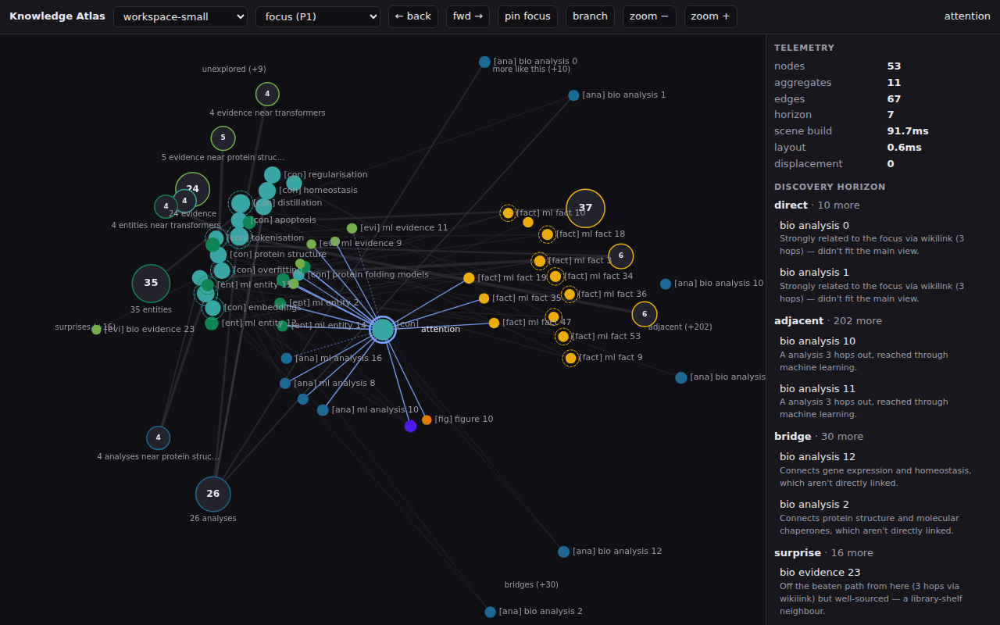

# @curiosity/knowledge-atlas

An embeddable knowledge-atlas viewer engine: comprehend and navigate
substantially more structured knowledge per screen than folders,
search results or ordinary graph viewers — with a protected,
explainable discovery horizon instead of an opaque feed.



- **Framework-independent core** (`src/core`): bounded scene builder
  (ranking, aggregation, six explainable discovery classes, type/source
  landmarks, edge priority tiers), branching inquiry trails, semantic
  zoom with hysteresis, hit testing, telemetry, seeded determinism.
- **Canvas 2D renderer** (`src/renderer`) with object-correspondence
  transitions and DPR/reduced-motion/theme support ([why Canvas —
  ADR-001](docs/adr-001-renderer-and-geometry.md)).
- **React adapter** (`src/react`) — one component + `useAtlas` hook,
  React 18 peer.
- **Data sources** (`src/datasources`): Curiosity Engine `data.json`
  adapter (all payload sharp edges normalised), deterministic fixtures,
  a simulated 1,000,000-node corpus served through bounded scenes, and
  a cloud-style remote source — all behind one `AtlasDataSource`
  interface. The client never receives an unbounded graph.

Full design: [`PLAN.md`](PLAN.md). Mode comparison + recommendation:
[`docs/results.md`](docs/results.md). Perf: [`docs/performance.md`](docs/performance.md).
Seams: [`docs/extension-points.md`](docs/extension-points.md).

## Develop

```sh
pnpm install
pnpm dev        # experiment harness on http://localhost:5199
pnpm test       # vitest unit suite (44 tests)
pnpm e2e        # Playwright against the harness (self-starting)
pnpm run build  # dist/: ESM (core + react) + self-contained IIFE
```

If Playwright's managed browser isn't installed, point at a system
Chromium: `PW_CHROMIUM_PATH=/opt/pw-browsers/chromium pnpm e2e`.

## Embed

- **Curiosity Engine**: already wired, flag-gated —
  `http://localhost:8090/?viewer=atlas` on the built-in viewer. See
  [`examples/curiosity-engine/`](examples/curiosity-engine/README.md).
- **Switchbay / any React host**: see
  [`examples/switchbay/AtlasTab.tsx`](examples/switchbay/AtlasTab.tsx).
- **Any page**: `dist/knowledge-atlas.iife.js` exposes
  `window.KnowledgeAtlas.mount(container, { data, onOpenItem })`.

The published surface is `AtlasDataSource` in, `AtlasEvent` out,
`AtlasController` for commands — hosts own search, doc panels,
breadcrumbs and styling. The harness (`harness/`) and fixtures are
dev-only and excluded from the package `files`.
